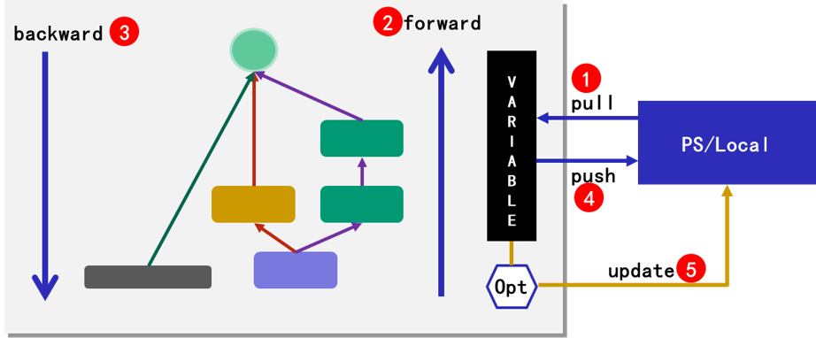
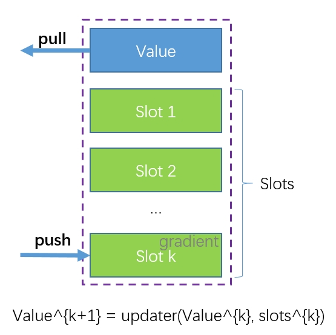
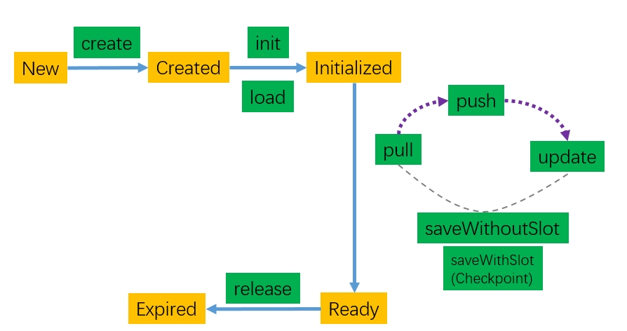

# mlcore
a stand alone machine learning suite which can easy to integrate with angel ps

```
<dependency>
    <groupId>com.tencent.angel</groupId>
    <artifactId>angel-mlcore</artifactId>
    <version>0.1.1</version>
</dependency>
```

## 1. Architecture of mlcore
The core of mlcore is computation graph, which performs the forward and backward calculation and computes gradient automatically. The abstraction of `variable` and `optimizer` makes mlcore can run in everywhere include single node, Angel, Spark and so on. here is the architecture of mlcore:

here is the runtime architecture of mlcore:



- pull parameters from local or parameter server (PS)
- perform the forward calculation 
- perform the backward calculation to calculate gradient
- push gradient to local or PS
- finally, update parameter in local or PS

## 2. Variable and optimizer 
The `variable` is a vector or matrix with `slots` and `updater`. The `updater` is used to update the value of variable and `slots` are the auxiliary data of `updater`. The number of `slots` is decided by the type of `updater`.  Usually, the shape of value is the same as that of slot.  



The `variable` and `updater` are interfaces in mlcore. Different distributed systems can implement their own variables and updaters. In this way, mlcore is easy to embed into other distributed systems.

The basic operation of `variable`
- create: create a `variable` in PS or local
- init: initial a `variable` in PS or local
- load: load data from disk to initial a `variable` in PS or local
- pull: pull the value of a `variable` from PS or local
- push: push gradient of a `variable` to PS or local
- update: update a `variable` in PS or local, the `slot` attached will also updated if necessary.
- saveWithSlot/saveWithoutSlot/checkpoint: save a `variable` in PS or local. as mentioned about, `variable` usually with slots, you can choose to save slots or not. *note*: **checkpoint** is the same as **saveWithSlot**
- release: release a `variable` in PS or local

The status and life cycle of a `variable`:



The top abstraction of `updater`:
```scala
trait Updater extends Serializable {
  val numSlot: Int

  def update[T](variable: Variable, epoch: Int, batchSize: Int): Future[T]
}
```

## 3. Computation graph
The computation graph in mlcore is coarse grain, the basic operator is layer. The coarse grain computation graph has a smooth learning curve. Consequently, it is user friendly. 